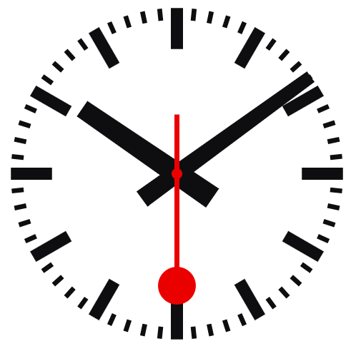

# mondaine-clock-react

Unofficial implementation of the official Swiss station clock by Mondaine



[demo](https://codesandbox.io/s/polished-forest-h9t97s)

## Installation

```bash
npm install mondaine-clock-react
```

## Usage

```jsx
import React from 'react';
import MondaineClock, { TickType, MinuteAnimationType } from 'mondaine-clock-react';

function App() {
  return (
    <div>
      <MondaineClock 
        width="200px"
        tickType={TickType.MECHANICAL}
        minuteAnimationType={MinuteAnimationType.SMOOTH}
      />
    </div>
  );
}

export default App;
```

### Props

- `width` - Width of the clock (default: '100%')
- `tickType` - Clock movement type: `TickType.MECHANICAL` or `TickType.QUARTZ` (default: MECHANICAL)
- `minuteAnimationType` - Minute hand animation: `MinuteAnimationType.NONE`, `SMOOTH`, or `JUMP` (default: SMOOTH)
- `fixedDate` - Optional fixed date to display (default: current time)
- `showSecondsHand` - Show/hide seconds hand (default: true)
- `showCenterDot` - Show/hide center dot (default: true)
- `faceColor` - Color of clock marks (default: '#0e0e10')
- `faceBackgroundColor` - Background color (default: '#ffffff')
- `secondsHandColor` - Seconds hand color (default: '#eb0000')
- `minutesHandColor` - Minutes hand color (default: '#0e0e10')
- `hoursHandColor` - Hours hand color (default: '#0e0e10')

## Building

```bash
npm run build
```